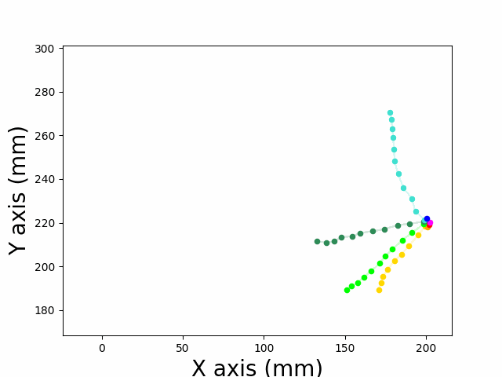
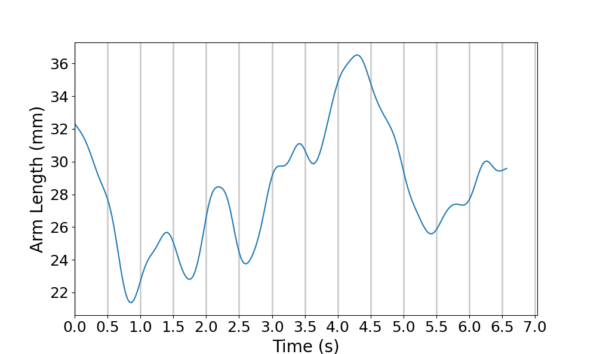

# タコの這行運動の解析プログラム
"DeepLabCut"でモーショントラッキングを行った、タコの特徴点の座標を解析するプログラム
## 構成
- amam_2023
    - AnalyzeCrawling.py : 前処理・解析・結果のプロットを一括で行うプログラム
    - preprocessing
        - Preprocess.py : 前処理を行うプログラム
    - analyze
        - Analyze.py : 解析を行うプログラム
    - plot
        - CoordinatesPlot.py : 座標データのプロットを行うプログラム
        - ResultPlot.py : 解析結果のプロットを行うプログラム
        - tool.py : 座標データや解析結果を整理するプログラム

## 使用方法
### Pythonの環境を構築
#### 1. Pythonのパッケージ管理ツールである "poetry" とバージョン管理ツールである "pyenv" をインストール  
インストールは以下のリンク参照  
    - [poetry の公式サイト](https://python-poetry.org/)
    - [pyenv の github](https://github.com/pyenv/pyenv)
#### 2. "poetry.lock" があるディレクトリで以下のコマンドを実行
```bash
pyenv install 3.9.8  # python 3.9 のインストール
pyenv local 3.9.8  # 現在のディレクトリの python のバージョンをpython 3.9に設定
poetry install  #  "poetry.lock"を基にパッケージをインストール
```

- Ubuntu 22.04.2 LTS
- Windows11 Pro wsl(Ubuntu 20.04.4 LTS)  
で動作確認済み

## プログラムの実行
### 1. パラメータの設定 (jsonファイルびパラメータを記述する方法に変更予定）  
"AnalyzeCrawling.py"の`__init__`関数で行う変数の代入の値を変更
```python
# "AnalyzeCrawling.py"の該当箇所

"""
前処理
"""
Th_Lh = 0.8  #  欠損値のしきい値 (float, 0~1)
Th_data = 0.3  #  データ数のしきい値（"centre"の何割か）(float, 0~1)
self.fs = 30  #  フレームレート (int)
self.fc = 3  #  ローパスフィルターのカットオフ周波数 (int)

#  解析データの保存
self.save = False  # 解析データを逐一保存するか (bool)
self.path_save = "result"  #  解析データを保存する場所 (str)

"""
解析
"""
#  接地判定
self.speed_Lh = 10  #  接地と判定する速さのしきい値(mm)(float)
#  腕の近位と遠位の接地判定
self.sucker_separate = 5  #  根本の吸盤からいくつまで吸盤まで腕の近位とするか (int)
#  重回帰分析による加速度の推定とAICによるモデル選択
self.stop = 160 #  加速度の予測をどのフレームまで行うか(int)
```  

### 2. 前処理
以下のコマンドを実行し python を起動
```bash
poetry shell # 仮想環境の立ち上げ
cd amam_2023 # ディレクトリの移動
python # python の起動
```
python 起動後、解析のデータを管理するインスタンスを生成
```python
# python

import AnalyzeCrawling
AC = AnalyzeCrawling.AnalyzeCrawling() # インスタンスの生成
```
インスタンス生成時に座標データの前処理が行われる。  
__前処理の前の座標データのプロット__(画像座標なので反転しています、単位もpixcelです)


__前処理後の座標データのプロット__（実座標）



前処理をすることで信頼度の低いデータの除去とデータの欠損の補完ができる。またここでは同時に画像座標を実座標へと変換している。詳しい処理の内容は"preprocessing"のディレクトリを参照。

上記の前処理後の座標データは以下の関数により確認できる
```python
AC.CheckCoordinate(frame_first=0, frame_end=200, interval=100, fileName_save="coordinates.gif")
# 引数は、開始フレーム・終了フレーム・コマ送りの速さ・保存時の名前
```

### 3. 解析
- 吸盤の接地判定
```python
AC.GroundedSuckers(arm="r1")  # 引数で指定した腕の吸盤の接地判定
```
（出力例）  


横軸は時間（フレーム）、縦軸は各吸盤のインデックス。黒線は吸盤が接地していることを示す。

- 腕の屈曲具合の評価
```python
AC.ArmCurve(arm="r1")  # 引数で指定した腕の屈曲具合の評価
```
（出力例）  


横軸は時間（フレーム）、縦軸は腕の吸盤で回帰分析をした時の平均二乗誤差。縦軸の値が小さいほど腕が線形であることを示す。

- 身体の中心と各吸盤の距離
```python
AC.DistanceFromCentre(arm="r1", index_sucker=5) # 引数で指定した腕の吸盤の身体の中心からの距離の計算
```
（出力例）  


横軸は時間（フレーム）、縦軸は身体の中心から対象の吸盤までの距離

- 腕の接地情報を用いた加速度の推定
```python
AC.AccelerationPredict(stop=160)  # 引数で指定したフレームまでの身体の中心の加速度を腕の接地情報を用いた重回帰分析により推定
```
（出力例）  


横軸は時間（フレーム）、縦軸は加速度、オレンジが実際の値で青が予測の値


横軸は腕の部位、縦軸は偏回帰係数